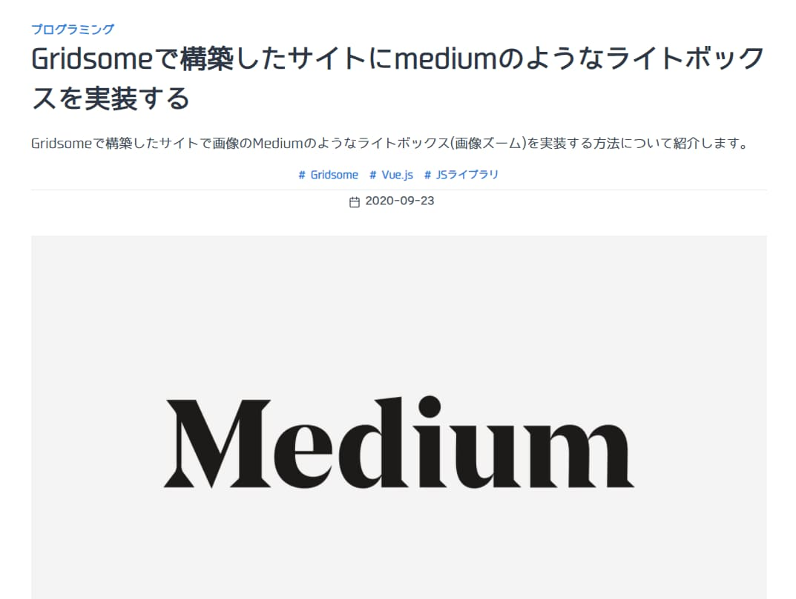

## Mediumのようなライトボックスとは

まずライトボックス（Lightbox）についてですが、簡単に言うとページ内の通常縮小された状態で表示される画像をクリックした時に拡大して表示する機能のことです。
よくあるものですよね。

で、"Meidumのようなライトボックス"ですが、これは実際に見たほうが早いかと思います。
ちょうどMedium公式で画像を多用している良い記事があったのでリンクします。

[$card](https://medium.com/for-shirusu/tips-and-tricks-for-posting-photos-and-images-on-medium-6800b157b5a2)

上記記事内の画像をクリックしてみてください。拡大表示されるのですが、ヌルっとした感じで拡大表示されることがわかると思います。

このヌルっとした感じのライトボックスをGridsomeで構築したサイト（本ブログ）でも実装してみました。

## medium-zoomライブラリ

どうやって実装するかですが、なんとありがたいことにライブラリが既にあるんですね。

その名もずばり"medium-zoom"。

[$card](https://github.com/francoischalifour/medium-zoom)

このライブラリを使うことで、まんまMediumと同じライトボックスを実装できます。Gridsomeでも問題なく使用できるのでそのやり方を紹介したいと思います。

### インストール

```bash
yarn add medium-zoom
```

### 実装方法

本ブログではマークダウンファイルを使って記事を書いています。GraphQLで取得したHTML変換後のマークダウンファイルをブログ記事として出力するvueファイルがあるため、そこでmedium-zoomを使用します。

詳しい使い方はGitHubのREADMEを参照してほしいのですが、基本的にはmedium-zoomのAPIのパラメータに対象のCSSセレクターかHTMLエレメントを指定します。
対象というのはつまり画像（imgタグ）のことですね。

```markup
<template>
  <div class="markdown-body pb-4" v-html="$page.post.content" />
</template>
<script>

<page-query>
query Post($id: ID!) {
  post(id: $id) {
    title
    path
    summary
    date: date(format: "YYYY-MM-DDTHH:mm+09:00")
    updatedAt: updatedAt(format: "YYYY-MM-DDTHH:mm+09:00")
    image
    imageCaption
    category {
      title
      path
    }
    tags {
      title
      path
    }
    content
    headings {
      depth
      value
      anchor
    }
  }
}
</page-query>

export default {
  async mounted() {
    const mediumZoom = await import("medium-zoom");
    mediumZoom.default(".markdown-body p > img", {
      margin: window.innerWidth < 680 ? 8 : 48,
      background: "rgba(26, 32, 44, 0.9)"
    });
  }
};
</script>
```

関係ない部分は省略しています。
medium-zoomはDOMに対象のエレメント/セレクターが存在しなければならないため、Vueのライフサイクルフックのmountedで使います。
mountedで動的にmedium-zoomをimportしてmediumZoomのAPIを使います。

```js
mediumZoom.default(".markdown-body p > img", {
  margin: window.innerWidth < 680 ? 8 : 48,
  background: "rgba(26, 32, 44, 0.9)"
});
```

第1パラメータで対象を指定しています。第2パラメータでオブジェクトをオプションとして渡せます。
指定可能なオプションはGitHubを参照してほしいのですが本ブログでは以下を指定しています。

- margin：画像拡大時のマージン(画面幅に応じて動的にセット)
- background：画像拡大時オーバーレイ背景

上記のように実装すると↓のようになります。クリックすると拡大表示されます。



## おわりに

Medium風のライトボックスを実装しましたがライブラリのおかげでわずかなコードで簡単に実装することができました。
本ブログはGridsomeを使っていますが、このライブラリはVueやNuxtでも使えるはずなのでぜび使ってみていただければと思います。