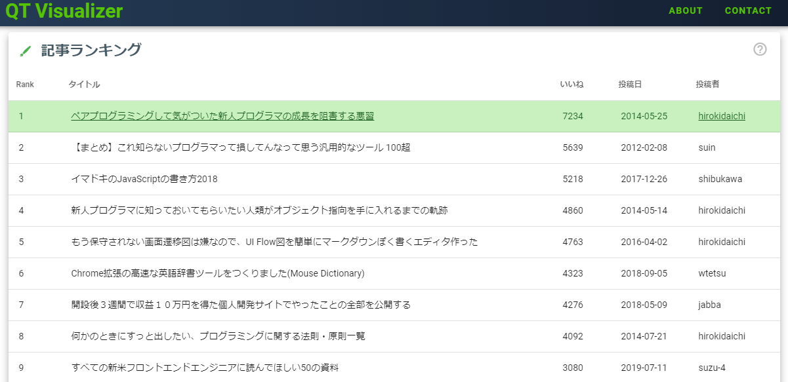
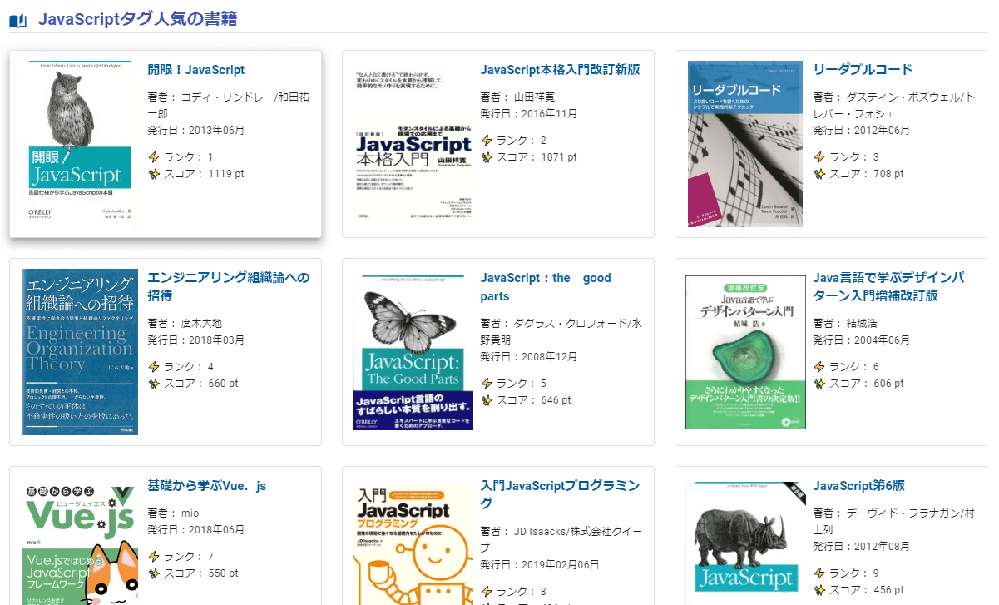

## はじめに

もう開発してリリースしたのは１年も前なのですが、、
QiitaのAPIを利用したWebサービス、QT Visualizer｜【Qiita技術記事のランキング】というものを作りました（作って運用しています）

[$card](https://qtvisualizer.com/)

リリース後Qiitaに投稿したのみでこのWebサービスについてあまり紹介できていなかったので今回改めてブログで紹介したいと思います。

## コンセプト

Qiitaは日々多くの技術記事が投稿されています。大量に投稿される記事を分析して技術的なトレンドや優れた記事を投稿しているユーザなど可視化するというのがコンセプトです。

UIや操作感などは当初[Googleトレンド](https://trends.google.co.jp/trends/?geo=JP)のようなものを目指していました。が、そこは結局全く似ていないものになっています、、

## できること

Qiitaは記事にタグ付けすることができます。QT Visualizerはタグに着目して分析をしています。
全タグのうち記事に付与された数で上位1000タグを分析・集計対象として**タグごとに以下の集計結果を見ることができます。**

- 記事数の月間投稿推移
- いいね(LGTM)数による記事ランキング
- いいね(LGTM)数によるユーザランキング
- 上位ユーザが投稿した記事
- 人気の技術書籍＋書籍の被引用記事

↓JavaScriptタグ人気の記事ランキング

↓JavaScriptタグ人気の書籍ランキング

また、タグに関係なくQiitaのその年に投稿された記事を集計した年間ランキングも見ることができます。年間ランキングは2011年から年毎のデータを見ることができます。

## 開発で使用した技術

技術的なことの紹介。

### フロントエンド

フロントエンドはVue.jsで構築したSPAとなっています。UIフレームワークとしてVuetifyを使用しています。ちなみにTypeScriptは使用していません。

- [Vue.js](https://jp.vuejs.org/index.html)
- [Vuetify](https://vuetifyjs.com/en/)

その他ライブラリとしてはVuexやグラフ描画のためのchartjsなどを入れています。

- vuex
- vue-chartjs
- vue-awesome-swiper
- vue-countup-v2

### バックエンド

バックエンドはPythonを使っています。Pythonのマイクロフレームワークであるflaskを使用してAPIサーバーとして構築しています。

フロントのVueからのリクエストで、各データストアから必要なデータを取得してレスポンスを返すという流れです。データストアはRedisおよびAmazon S3で、S3にはあらかじめ集計・分析しておいたデータをjsonファイル/csvファイルとしておいてあります。

また、Qiita APIで取得した記事データはMongoDBに格納しているのですがリクエストのたびにMongoDBからデータを取って加工してレスポンスするというのはパフォーマンス的によくないため、flaskからはほぼアクセスしません。
あらかじめデータ加工バッチによって、MongoDBのデータを加工してRedis/S3に入れておくという運用をしています。

[$card](https://github.com/pallets/flask)

- flask
- Redis
- Amazon S3
- MongoDB

### バックエンド(バッチ)

前述のとおり、Qiita APIを叩いて記事データを取得、加工するといったことはバッチで行っています。こちらはプロジェクト的にも分けており完全にバッチ専用のプロジェクトとして独立しています。

バッチはサービス開始以来毎日動いてQiitaから最新記事の取得、データ加工等を行っています。

バッチ本数は20弱ほどです（毎日すべてのバッチが動いているわけではないです。このうち数バッチが日次バッチとして実行しています）
ちなみに年に1度しか動かない年次バッチもあります笑

### インフラ

インフラの紹介ですが、ほぼHerokuです。

アプリ本体はHerokuにデプロイしています。RedisやMongoDBもHerokuのアドオンを使用しています。
バッチプロジェクトもHerokuにデプロイしており、バッチ実行もアドオンの[Heroku Scheduler](https://elements.heroku.com/addons/scheduler)や[Advanced Scheduler](https://elements.heroku.com/addons/advanced-scheduler)で運用しています。

あとはCDNとしてCloudflareを使用しています。
HTTPリクエストはフロントのVue → Cloudflare → flaskとなるのですが、Cloudflareでキャッシュがあった場合はそこでキャッシュ済みのデータを返しています。

[Cloudflare](https://www.cloudflare.com/ja-jp/)

## サービス運用コストについて

QT Visualizerの運用コストですがほぼ無料です。Herokuは無料プランで利用・アドオンも無料のものを利用しているので全く料金が発生していません。

ただ、Amazon S3だけコストが毎月1ドルかからないぐらいの料金が発生しています。1日に数回バッチが動いてその都度加工データファイルのS3へのread/writeが発生しているので無料枠を若干オーバーしてしまっていますがこれはしょうがないですね。
その分最新のデータを提供することができています。

なので、月の総コストとしてはS3の1ドル未満の料金だけで運用できています。

Herokuの無料プランはリージョンがヨーロッパか北米しかなく、その分パフォーマンスが落ちてしまうのですがそこをCloudflareのキャッシュでカバーしています。
実際に見てもらうと実感できると思うのですが結構サクサクな動作を実現出来ていると思っています。

## サービスの今後について

QT Visualizerの今後についてですがまずHerokuのMongoDBアドオンがなんと**2020年の11月10日で廃止されてしまう**のでそれは移行を考えています。

>[mLab MongoDB Add-on Discontinued](https://devcenter.heroku.com/changelog-items/1823)

>The mLab team has discontinued their MongoDB add-on. The mLab MongoDB add-on will be removed from all Heroku apps on November 10, 2020. Users should remove add-on instances attached to their apps via the Dashboard or the CLI.

移行先は[MongoDB Atlas](https://www.mongodb.com/cloud/atlas)になりそうです。Herokuから移行できる措置がとられており比較的スムーズに移行することができそうです。
また、MongoDB Atlasにも無料枠があり、移行したとしても引き続き無料で運用できます。

あとは、フロントのVue.jsをTypeScriptで全面的に書き直そうとしており、それに伴ってデザイン面を大幅に変更しようと考えています。
今のところ、もっとダッシュボード的なUIにしたいなぁ～と思案中。

MongoDBの移行は早急にやる必要があるとして、UI面の変更も今年中にやりたいと思っているところです。

ちなみにVuetifyが対応していないため、Vue3へはアップグレードしません。対応していたらしたいところですが。。

## おわりに

以上、個人開発したWebサービスの紹介でした。
実は[QT Visualizer](https://qtvisualizer.com/)が初めて作ったWebサービスになります。

最近はあまり作れていないですが、アイディアは日々ためているのでまた開発していきたいと思っています😁