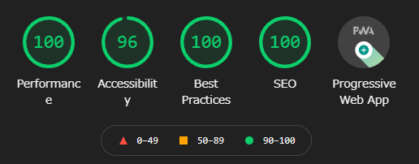

## Gatsbyでブログを作り直しました

このブログはもともとVue.jsの静的サイトジェネレータであるGridsomeを使って構築していたのですが、React製の静的サイトジェネレータであるGatsbyで作り直しました。

ブログ記事自体はマークダウンで作成していたのでほぼそのまま移行し、その他のすべてをゼロからGatsby（React）で書き直しました。

## 作り直した理由

作り直した理由はGridsomeのメンテ状況が昨年から停滞してきていたことが一番の理由です。

[Gridsome](https://github.com/gridsome/gridsome)

2021年5月現在、Gridsome本体の最新バージョンは`0.7.23`でリリース日は昨年の11月となっています。それ以降Gridsome公式の各ライブラリも含めて更新がされていない状況です。

もちろん約半年という期間はそこまで空いているとは言えないかもしれません。しかし、バージョン1にもなっていない中、バージョン0.7までのリリース状況なども見ると現状はメンテナンス（というか開発）がされなくなりつつあるように見えます。。

私はGridsomeのリポジトリをそこそこウォッチしていましたが、最近はissueも投稿されず、されてもメンテナからの応答がなく放置されているものもちらほらある状態です。

GridsomeにはGatsbyと同様に有志が開発できるプラグインというエコシステムがあります。Gridsome本体のメンテナンス停滞に伴ってそれらのコミュニティプラグインの更新もほぼされなくなっていました（Gridsomeのエコシステムが崩れつつあるように感じました）

対照的にGatsbyは公式の開発も活発で、それにあわせてコミュニティプラグインなどのエコシステムがどんどん成長しています。上記の理由があってGatsbyへの移行を決めました。

※ ただし、Gridsomeは現状でもブログ構築に必要な機能・ライブラリは揃っていますし、サイトのパフォーマンスもWordPress等に比べれば圧倒的で、高パフォーマンスを出すこと自体も難しくありません。**Gridsomeが使えないということは言ってないのでそこは注意願います😉**

## Gatsbyへ移行するにあたりしたこと

私はGatsbyを使うのは初めてでしたが、それ以前にReactも触ったことがありませんでした。。

Gatsbyにはスターターといって、すでにサイト(ブログ等)が構築されたライブラリがあります。これは公式で用意されているものもありますが、ほとんどは誰かが作成したスターターライブラリです。

[Starter Library](https://www.gatsbyjs.com/starters/)

まずはこのスターターから、マークダウンブログのテンプレートの中で気になったものを見つけてプロジェクトの構造やソース、使用ライブラリなどをざっと眺めて雰囲気をつかんでいました。
特に良いなぁと思ったものは実際にクローンしてローカルで挙動を確認したりしていました。

その後はGatsby、Reactのチュートリアルドキュメントを一通り読んであとは実際にプロジェクトを作って手を動かしてブログを作りました（Gatsbyのドキュメントは導入部分以外は必要に応じて読む感じで、メインはReactのドキュメントのほうでした）

なので、いくつかのスターターは参考にさせてもらいましたがブログ自体には使っておらずすべてイチからブログを構築しました！

[チュートリアル：React の導入](https://ja.reactjs.org/tutorial/tutorial.html)

## Gatsbyブログで入れたライブラリ

Gatsbyに移行した際に導入した主なライブラリについて紹介します😊

### UI・スタイル系

UIフレームワークはReactのスタイリング方法の多様さもあって、色々調査して悩みましたがTailWindCSSを使うことに決めました（Gridsomeの時も使っていたという理由もあります）

ただし素のTailWindCSSではなく、TailWindCSSをCSS-in-JSとして書けるtwin.macroとemotionを導入しています。

[Twin.macro](https://github.com/ben-rogerson/twin.macro)

実際に使用してみて、CSS-in-JSとTailWindCSSの良いところどり？の感じでかなり使いやすい技術スタックだと思っています。

他には[Material-UI](https://material-ui.com/)も検討していて、実際に入れて使用感を確認しましたがちょっと違うなぁという感じで上記に落ち着きました。

同様にマテリアルデザインを実装するVue.jsのVuetifyを良く使っているのでそれと同じような感じかなと思ったのですが、Material-UIは自分でスタイルを実装する部分がVuetifyよりも圧倒的に多くそれなら使わなくても良いやとなりました（コンポーネントで用意されているPropsの数が全然違う）

### 画像処理系

画像処理系のライブラリはGatsby公式から提供されている`gatsby-plugin-image`を入れました。これはもともと提供されていた`gatsby-image`の後継ライブラリとなります。

[gatsby-plugin-image](https://www.gatsbyjs.com/plugins/gatsby-plugin-image/)

Gatsbyの画像処理まわりはかなり高機能ということは知っていたのですが、jpgやpng画像からWebP画像を自動生成してくれるというのが感動しました😆

しかも、WebP画像に対応していないブラウザのために`<picture></picture>`タグと`<source>`タグまで生成してくれるという至れり尽くせりな感じでもうすごいねって感じです（当初、画像のだし分けは自分で実装しないとなぁと思っていました、、）

### 型付け系

もう今は型付けは必須ですよね。このブログもTypeScriptで実装しています。

ただ、GatsbyでTypeScriptを使うことで困る部分があってそれはGraphQLの型付けです。自分で型を書くことは可能ですがかなり苦労するのが目に見えています。

そこで使うのが`gatsby-plugin-typegen`です！

[gatsby-plugin-typegen](https://github.com/cometkim/gatsby-plugin-typegen)

プロジェクトのGraphQLスキーマの型定義を自動生成してくれるという素晴らしいライブラリです😄

これを使うことでGraphQLも型安全にすることができます。注意点としては自動生成される型定義はほとんど`Maybe`が使われているので、そこはundefinedでないことを保証するように実装する必要があります。

ちなみに同様に型定義を自動生成できる`gatsby-plugin-graphql-codegen`というライブラリもありますが、こちらは残念ながらメンテナンスが困難になってしまったようで、上記の`gatsby-plugin-typegen`を使うようにとリポジトリに記載があります。

## Gatsbyブログのパフォーマンス

作り直した後のブログのパフォーマンスは以下のとおりでLightHouseはほぼ満点になりました！

Gridsomeの時もほぼ同じぐらいの点数でしたが、Gatsbyで作り直した後はもう一歩高いパフォーマンスになったかなという感じです。

体感的にもよりサクサクになった気がします⚡

## これから実装したいこと

ダークモードとか、関連記事とか色々考えています。あとはソースの全体的なリファクタリングなど（ページ・コンポーネント設計とか）

React自体初めて触る技術だったので、ベストプラクティスみたいのもわからず一気にブログを構築したので実装しながらも気に入らない部分がそこそこありました（あります）

そういうところは今後継続的にリファクタリングしていきたいと思っています😊

## ブログのソースコード

ちなみにこのブログのソースコード（リポジトリ）は公開しています👋

[myblog](https://github.com/k-urtica/myblog)