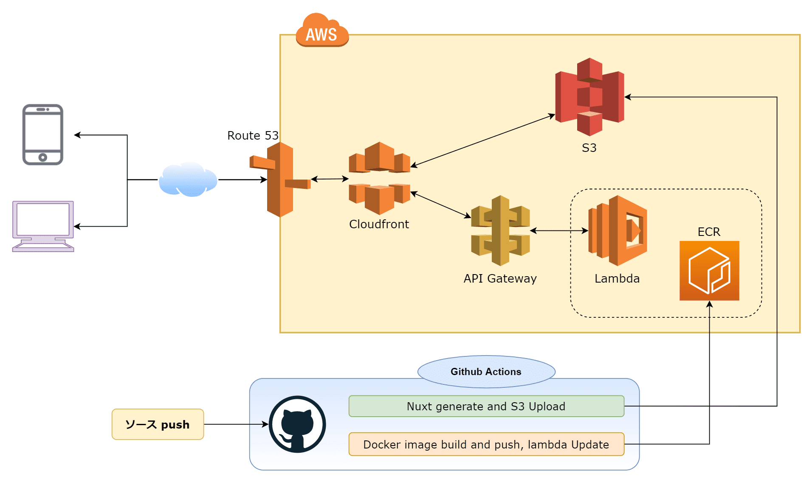
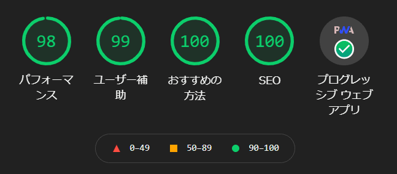

## はじめに

新しいWebサービスを作った😆
ブラウザ上で利用できるプログラミングやWeb制作などに使えるツール集、**Web ToolBox**↓

[Web ToolBox](https://web-toolbox.dev/)

ツールの種類としてはBase64エンコード・デコードや文字数・英単語カウント、QRコード生成、JSON整形ツールなど特定のジャンルによらない様々なツールを公開しています。
（まだまだ数が少ないですが順次色々なツールを追加していく予定です✊）

## なぜWeb ToolBoxを作ったか

作った理由はそこまで深い理由はないです😅
最近仕事上で使っているあるデータに対してBase64エンコード・デコード処理をする必要が多くあり、ブラウザ上でそれらのツールを公開している、Web ToolBoxと似たようなサイトを毎日使っていたからです。

使っていたツールサイトがなんとなく使いずらいなぁと思っていたのと、これだけ毎日使うことがあるなら自分で同じようなツールを公開するものを作ってみるのも良いな～と、思ったことがきっかけでした。

## Web ToolBoxの使用技術・構成

Web ToolBoxは[Nuxt.js](https://ja.nuxtjs.org/)を使用して構築しています。UIフレームワークに[Vuetify](https://vuetifyjs.com/ja/)を使用してフロントエンドのスキルセットの中で自分が得意な技術で作りました。

あと、NuxtはTypeScript使ってます。やっぱ型は良いもんですよ😏

ホスティングはNuxtで静的に生成した資産をAmazon S3にアップロードしてCloudFrontを通じて静的サイトとして公開しています。

公開している各ツールは、基本的にはブラウザ上で処理が完結するものばかりですが、一部のツールでサーバーサイドのPythonを使ってツールの機能を実現しているものもあります。
それらのツールは、バックエンドのAWS LambdaへデプロイしているPython（[Fast API](https://fastapi.tiangolo.com/ja/)）に対してAPIでやり取りしています。

大まかな構成図は↓のような感じ。



### フロントエンド

前述の通りフロントエンドはNuxtで静的生成したサイトをS3へアップロードして公開しています。
GitHubのmainブランチ更新をトリガーにして、GitHub ActionsでNuxt generate／S3へアップロードを自動で行っています。

参考までに、使っているGitHub Actionsの定義です↓
AWSのアクセスキーやS3のバケットネーム等々はsecretsで定義しています。

```yaml:title=.github/workflows/deploy.yml
name: Deploy to S3

on:
  push:
    branches: [main]
  # Allows you to run this workflow manually from the Actions tab
  workflow_dispatch:

jobs:
  build:
    runs-on: ubuntu-latest

    env:
      BASE_URL: ${{ secrets.BASE_URL }}
    steps:
      - uses: actions/checkout@v2

      - uses: actions/setup-node@v2
        with:
          node-version: "12"

      - name: Install all deps
        run: yarn install --frozen-lockfile
      - name: Generate files for static hosting
        run: yarn generate

      - name: Configure AWS Credentials
        uses: aws-actions/configure-aws-credentials@v1
        with:
          aws-access-key-id: ${{ secrets.AWS_ACCESS_KEY_ID }}
          aws-secret-access-key: ${{ secrets.AWS_SECRET_ACCESS_KEY }}
          aws-region: us-east-1

      - name: Upload dist files to S3
        env:
          S3_BUCKET_NAME: ${{ secrets.AWS_S3_BUCKET }}
        run: |
          aws s3 sync ./dist s3://$S3_BUCKET_NAME --exact-timestamps --delete

```

### バックエンド

バックエンドはPythonのプロジェクトで、モノレポ構成とはせずフロントのNuxtとは別リポジトリで管理しています。
このPythonプロジェクトはPythonのフレームワークのFast APIを使ってAPIサーバーとしてAWS Lambdaで動くようにしています。

こちらもmainブランチの更新をトリガーにしてGitHub Actionsが動くようにしていて、
Dockerコンテナイメージのビルド、ECRへのpush、Lambda関数の更新を自動で実行するようにしています。

こちらも参考までに、GitHub Actionsの定義です↓

```yaml:title=.github/workflows/deploy.yml
name: Build Docker image and push ECR, update lambda function

on:
  push:
    branches: [main]
  workflow_dispatch:

jobs:
  build:
    runs-on: ubuntu-latest

    steps:
      - uses: actions/checkout@v2

      - name: Configure AWS Credentials
        uses: aws-actions/configure-aws-credentials@v1
        with:
          aws-access-key-id: ${{ secrets.AWS_ACCESS_KEY_ID }}
          aws-secret-access-key: ${{ secrets.AWS_SECRET_ACCESS_KEY }}
          aws-region: ${{ secrets.AWS_REGION }}

      - name: Login to Amazon ECR
        id: login-ecr
        uses: aws-actions/amazon-ecr-login@v1

      - name: Build, tag, and push image to Amazon ECR
        env:
          ECR_REGISTRY: ${{ steps.login-ecr.outputs.registry }}
          ECR_REPOSITORY: ${{ secrets.AWS_ECR_REPO_NAME }}
          IMAGE_TAG: ${{ secrets.CONTAINER_IMAGE_TAG }}
        run: |
          docker build -t $ECR_REGISTRY/$ECR_REPOSITORY:$IMAGE_TAG .
          docker push $ECR_REGISTRY/$ECR_REPOSITORY:$IMAGE_TAG

      - name: Update lambda function
        uses: appleboy/lambda-action@master
        with:
          aws_access_key_id: ${{ secrets.AWS_ACCESS_KEY_ID }}
          aws_secret_access_key: ${{ secrets.AWS_SECRET_ACCESS_KEY }}
          aws_region: ${{ secrets.AWS_REGION }}
          function_name: ${{ secrets.AWS_LAMBDA_FUNCTION_NAME }}
          image_uri: ${{ secrets.AWS_ECR_REPO_URI }}:${{ secrets.CONTAINER_IMAGE_TAG }}
```

### インフラ

インフラはAWSを使用しています。

いつもなら静的サイトであれば、Netlifyにホスティングしてしまって、特に考えることもないのですが、、
今回はLambdaを使いたかったので、全面的にAWSを採用しました。

Nuxtで生成した静的サイトをS3（＋ CloudFront）でホスティングする際にちょっとはまったことがあったのですが別の記事で書こうかなと思います。
（"Nuxt S3"とかで検索すると出てくる、index.htmlが見つからないよ問題です）

### パフォーマンス

個人開発だからパフォーマンスは妥協しても良いでしょっていうのでは話にならないので、パフォーマンスもしっかりでるようにしています。

Lighthouseの結果は↓のような感じです。[Nuxt PWA Module](https://pwa.nuxtjs.org/)によりPWA対応もしています。



[アクセスしていただければ](https://web-toolbox.dev/)サクサク動くことを体験していただけると思います⚡

## 運営費用

Web ToolBoxのコストとしてはAWSの各サービス（Route53、S3、ECR、CloudFront、Lambda）に掛かってきます。
現状はまだまだ全然アクセス数が少ないので、毎月固定で掛かるRoute53の0.5ドルが一番大きく、他はそれ以下の微々たるコストです。

合計で大体、月1ドルいかないぐらいです💰
個人開発ではいかに低コストに抑えるかというのも結構気にしています（できれば無料で運営したい🙃

## マネタイズ

現状、収益化していません（できていません）
サービス自体で収益を得られるようなものではないので、Google AdSenseをそのうち利用しようかなと考えています。

## 今後追加したい機能

機能というか、ツールは徐々に増やしていきます。自分が使いたいものの他、便利なWebツールを公開していく予定です。

あとは、国際化対応をしたいなぁと思っています。
（[Nuxt i18n](https://i18n.nuxtjs.org/)を使って早めに対応したいところ）

## おわりに

**Web ToolBox**よろしくおねがいします👋

[Web ToolBox](https://web-toolbox.dev/)
