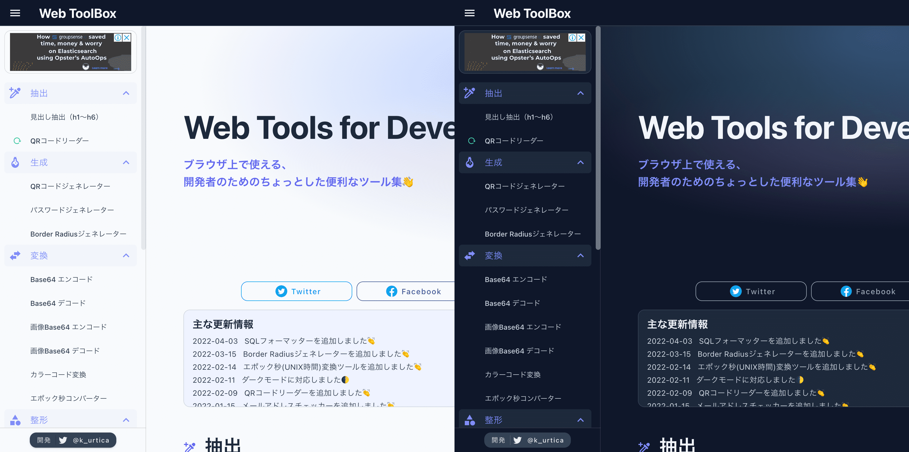

2022年3月の振り返りとスキップしてしまった2月の振り返り。

## Web ToolBoxの開発・更新

個人開発しているWeb ToolBoxですが、2月〜3月にかけてかなり更新しました。

[$card](https://web-toolbox.dev)

### 新規ツールの追加

新しいツールを3つ追加しました。

#### QRコードリーダー

PC・スマートフォン等から使えるQRコードリーダーを追加しました。
PCでも内蔵カメラやWebカメラがあればそのカメラを使ってQRコードをスキャンすることができるツールです。

また、QRコードが写っている画像ファイルからQRコードをスキャンすることもできます。

[$card](https://web-toolbox.dev/tools/qrcode-reader)

👉 PCからQRコードを読み取りたいことがあったので追加。

#### エポック秒コンバーター

エポック秒と日付を相互に変換できる、エポック秒コンバーターを追加しました。

[$card](https://web-toolbox.dev/tools/epoch-converter)

#### Border Radiusジェネレーター

CSSの`border-radius`を生成できるBorder Radiusジェネレーターを追加しました。
シンプルな形状のborder-radiusの他に、より複雑な形状のborder-radiusも生成可能です。

[$card](https://web-toolbox.dev/tools/border-radius-generator)

👉 このツールのために改めてborder-radiusについて調べましたが、結構奥が深かったです。

### ダークモードの実装

ダークモードに対応しました。
UIフレームワークにVuetifyを使っているので、実装自体はそこまで大変ではありませんでした。

また、ダークモードの実装に合わせて全体の配色やトップページのデザインを改善しています。

### release-drafterの導入

開発面の話ですが、今までGitHubのタグやリリース機能は使っていなかったのですが、ちゃんと使うようにしました。
リリース(ドラフト)を自動で作成してくれるrelease-drafterも導入しました。

[$card](https://github.com/release-drafter/release-drafter)

release-drafterはプルリクのラベルから良い感じにリリースドラフトを作成してくれます。
なので、今までmainブランチしか基本的に使っていませんでしたが、ブランチ戦略も変えました。

Web ToolBoxのリポジトリでは`main`とmainから作成する`feature`ブランチのシンプルなフローをとりました。
mainブランチはコミット禁止でプルリクを利用したマージのみ。各機能の実装などはmainからfeatureブランチを都度作成して実装します。

`feature`→`main`へマージするタイミングでrelease-drafterが実行されてリリースのドラフトが作成されます。
リリースドラフトを公開するタイミングでデプロイするようにしました。
（今まではmainブランチへコミットしたタイミングでデプロイしていました）

### Web ToolBoxの実績

| 項目                   |   3月 |   2月 |  1月 |  12月 |  11月 |  10月 |
| :--------------------- | ----: | ----: | ---: | ----: | ----: | ----: |
| PV                     |  7027 |  5175 | 7079 |  7267 |  8533 |  6249 |
| MAU                    |  1881 |  1963 | 3136 |  3249 |  3963 |  3325 |
| 平均ページ滞在時間(分) |  1:19 |  1:59 | 2:53 |  3:25 |  3:33 |  4:19 |
| 収益(adsense)          | ¥1119 | ¥1812 | ￥844 |  ￥241 |  ￥791 | ￥1298 |
| 支出(AWS)              | $0.68 | $0.64 | $0.7 | $0.68 | $1.63 | $1.33 |

収益はそこそこ。PVやユーザ数が下がり気味にきているので、マークアップの改善やページタイトル・metaタグの修正等SEO対策をしています😊

## 生活・仕事

生活面はだいぶ変わりました。2月に子どもが生まれて3月から7ヶ月ほど育休を取得しています。
エンジニアという仕事柄、育休を取得するために何の障壁もなくスムーズに取得できました😄

新生児期の2月はあっという間に過ぎ、早くも乳児期に入り、毎日仕事以上に忙しい気がしてます😅

今後も引き続き、合間合間に個人開発を続けたいと思います。
