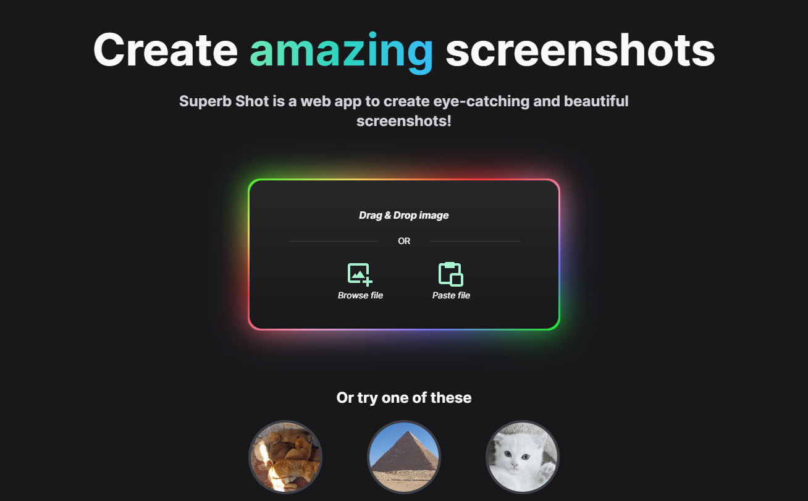

2022年8月の個人開発したことの振り返りと個人開発しているWebサービス(Web ToolBox)の実績を書く。

前回はこちら↓

[$card](https://knote.dev/post/2022-08-11/lookback-2022-07/)

## Web ToolBoxの開発

[$card](https://web-toolbox.dev)

メインで開発・運営しているWeb ToolBoxは、8月はほとんど更新しなかった（できなかった）。
後で書くけど、React/Next.jsに入門してNext.jsで試しにWebサービスを作っていたためWeb ToolBoxの方は手が回らなかった。。

とはいえ、[7月はかなり大きな更新をしていた](https://knote.dev/post/2022-08-11/lookback-2022-07/)ので更新が滞っているわけではない。ただ、利用者向けの更新としてツールの追加はしたかったかな。
利用してくれている人も増えてるし9月は頑張りたい。

## Web ToolBoxの実績

|                  | 2022/08 | 2022/07 | 2022/06 |
|:-----------------|--------:|--------:|--------:|
| **PV**           | 13,024  | 11,149  | 9,079   |
| **MAU**          | 5,451   | 4,890   | 4,077   |
| **平均ページ滞在時間(分)** | 2:41    | 2:54    | 2:47    |
| **収益(adsense)**  | ¥11,062 | ¥6,318  | ¥5,610  |
| **支出(AWS)**      | ¥98    | ¥110    | ¥90     |

※直近3ヶ月分まで。
ここ数ヶ月かけて諸々の数値が上昇してきて、8月はついに1ヶ月の収益が1万を超えてきた😆
まぁ、adsenseだからこの先どうなるかはわからない。このまま伸びていけば嬉しい。支出は安定して低く、やっぱりSSGサイトはコスト面で最強だ。

## React/Next.jsに入門した

今まで個人開発ではVue／Nuxtしか使ってこなかったけど、React/Next.jsに入門した。
理由としては以下。

1. Nuxt3の正式リリースが遅れていること
2. Nuxtでよく使うライブラリ達のVue3対応が遅れていること
3. 今後のエンジニアとしてのキャリアのため

1,2が一番の理由かな。Web ToolBoxもNuxt Bridgeへ移行してComposition APIに書き換えたりしたけど、正直Bridgeは安定していない。Nuxt3も正式リリース前とはいえissueをウォッチしてると致命的なバグが結構ポロポロ出ていてかなり不安定。SSGも対応してないし。
それと、よく使うライブラリ（VuetifyやPWA、i18n、その他諸々）が軒並みまだNuxt3やBridgeに対応していない。
今さらNuxt2で新規プロジェクトは作りたくないし、Nuxt3はまだ当分使えないしでReact/Next.jsに入門した。

3については、今後お仕事で本格的にフロントエンドをやっていくためにはReactができることが必須だったため（どちらかというと仕事ではバックエンドメインだった）

ということでまずはNext.jsの公式チュートリアルを実施。その後に一通りドキュメントに目を通した。

[$card](https://nextjs.org/learn/basics/create-nextjs-app)

Nuxtを使ってるからかNext.jsはあまり違和感なくインプット出来た。ただし、Reactはドキュメントを一通り読んだけど、実際に手を動かしつつインプットしていかないと厳しいなと感じた。
`useMemo`とか`useCallback`の使いどころがいまいち掴めていない。。
あとVueに比べてパフォーマンスまわりのことを自分で考えてキチンと設計・実装しないといけないということはわかった。

## Next.jsでなにか作ってみる

というわけで早速Next.jsで簡単なWebサービスを作ってみることにした。

作ってるものの一部のキャプチャ。スクリーンショットを簡単にきれいに加工できるような感じのWebサービス。なんとなく英語サイトで、気が向いたらi18nで日本語やその他言語の翻訳を入れようと思ってる。

## おわりに

8月はWeb ToolBoxの数値が非常に良かったけど、これを継続・向上させるためにこれからも頑張って開発していきたい😄

↓よろしくお願いします！

[$card](https://web-toolbox.dev)
